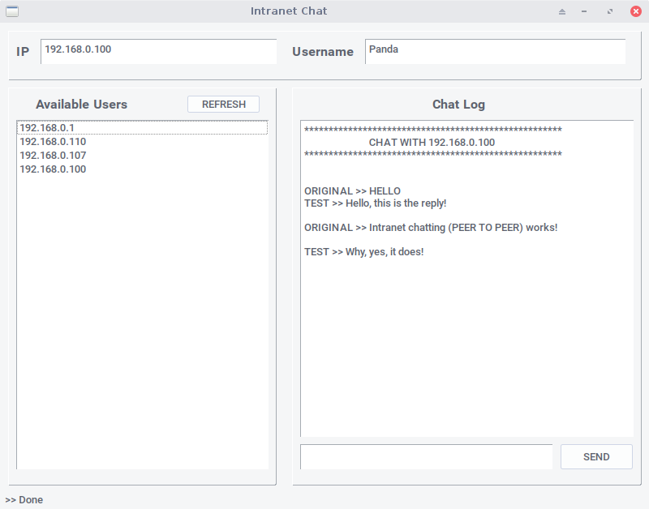

#Python Intranet Chat

This is an intranet chat app to, well, chat on your intranet.

It detects all the devices on your network and depending on whether they 
have the app running too, you can send text messages to them.

>Note: 
Remember to run this with Administrator Previliges.

###Screenshot

##Requirements

1. Python3
2. PyQt4
3. scapy-python3
